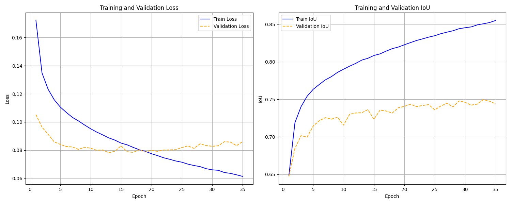
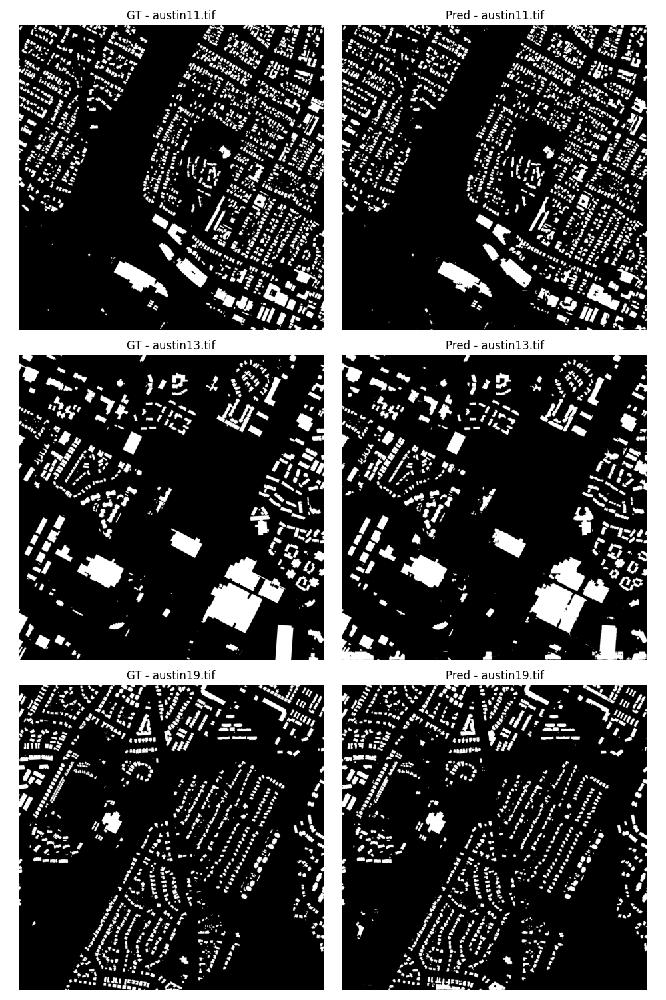
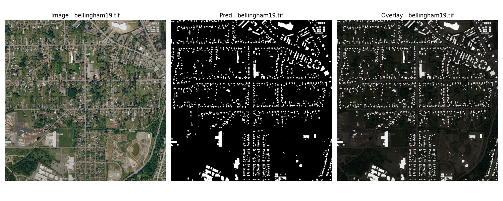
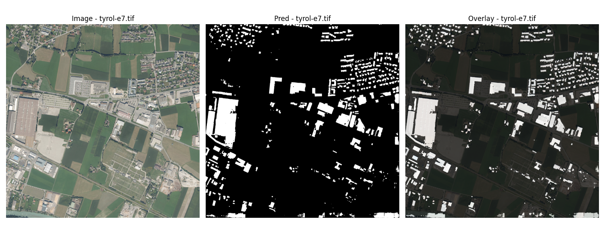
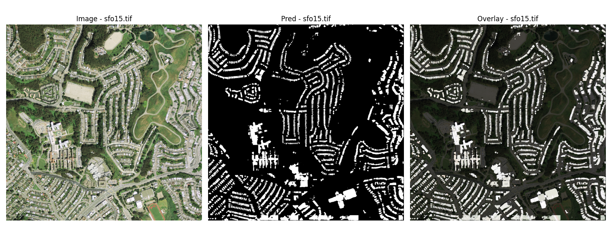

# Satellite Imagery Segmentation Project 🌍

Welcome! This project focuses on semantic segmentation of satellite imagery to identify buildings. 
We utilize the **INRIA Aerial Image Labeling Dataset** to train a **DeepLabV3+** model with a **ResNet50** backbone.

## The Mission

Our goal is to take raw aerial imagery and generate precise segmentation masks that highlight every single building. 
Whether it's a small house or a large commercial structure, the model aims to detect it accurately.


## The Data
We use the **INRIA Aerial Image Labeling Dataset**, which provides high-resolution aerial images with pixel-wise building labels.
*   **Dataset Link**: [Inria Aerial Image Labeling Dataset](https://project.inria.fr/aerialimagelabeling/download/)

## The Model

We are using a state-of-the-art segmentation architecture:
*   **Architecture**: [DeepLabV3+](https://arxiv.org/abs/1802.02611) - Known for its ability to capture multi-scale context.
*   **Backbone**: [ResNet50](https://arxiv.org/abs/1512.03385) - A robust feature extractor.

Since the DeepLab architecture is initialized with pretrained weights from the COCO dataset, 
the model already possesses robust general-purpose feature extraction capabilities. 
The main challenge is not learning fundamental shapes or edges, but adapting the network to the specific top-down
perspective and textures of satellite imagery. Therefore, a differential learning rate strategy is applied:
we carefully fine-tune the pretrained backbone with a low learning rate to avoid catastrophic forgetting,
while assigning a higher learning rate to the newly initialized classifier so it can quickly learn the target classes.

---

## Hardware & Performance ⚙️

The model is trained on the following hardware:
*   **GPU**: Nvidia RTX 4060 (8GB VRAM)
*   **Training Time**: Approximately **25 minutes per epoch**.

---

## How to Run

1. **Clone the Repository**:
    ```bash
    git clone git@github.com:BatBapt/satellite_image.git
    cd satellite_image
    ```
2. **Install Dependencies**:
   - Info: this project use Python 3.9.19, make sure to use a compatible environment. 
   - Install pytorch from the official website: [PyTorch](https://pytorch.org/get-started/locally/) if needed
   - Then install the rest of the dependencies:
    ```bash
    pip install -r requirements.txt
    ```
3. **Download the Dataset**:
    - Download the INRIA Aerial Image Labeling dataset from [Hugging Face](https://huggingface.co/datasets/blanchon/INRIA-Aerial-Image-Labeling) or using [INRIA](https://project.inria.fr/aerialimagelabeling/download/).
    - Make sure to update the path in the `config.yaml`file.
4. **Configure**: Check `models/config.yaml` to set your hyperparameters and your global settings.
5. **Preprocess the Data**: Run the data preparation script to slice the images and create the necessary datasets.
    ```bash
    python dataset_utils.py
    ```
6. **Train**: 
    ```bash
    python train.py
    ```
7. **Evaluate**:
    ```bash
    python eval.py
    ```
8. **Predict**:
    ```bash
    python predict.py
    ```
---

## Project Structure

Here's a breakdown of the key files in the repository:

### `train.py` - The Training Loop
This script handles the entire training process. It loads the data, feeds it to the network, calculates the loss, and updates the model weights. It also logs metrics to help track progress.

### `predict.py` - Inference
Once the model is trained, use this script to run predictions on new images. It processes large satellite images by splitting them into patches, running inference, and stitching the results back together.

### `eval.py` - Evaluation
This script evaluates the model's performance on the validation set. It calculates key metrics such as Precision, Recall, F1-Score, and IoU (Intersection over Union).

### `models.py` - Model Definition
Defines the `SatelliteDeepLab` class, which wraps the DeepLabV3+ architecture with the ResNet50 backbone.

### `dataset_utils.py` - Data Preparation
Handles data preprocessing, including slicing large images into smaller patches, creating train/validation splits, and defining the `CustomDataset` class.

### `viz.py` - Visualization
Contains utility functions to visualize the dataset samples and the model's predictions, useful for debugging and qualitative analysis.

### `configuration.py` & `models/config.yaml` - Configuration
*   **`configuration.py`**: The Python module that exposes settings to the rest of the code.
*   **`models/config.yaml`**: A YAML file for easy tuning of hyperparameters (e.g., `batch_size`, `learning_rate`) and global settings without modifying the codebase.

---

## Results 📊

Here we will showcase the model's performance.

### Training Log


We can see that the training loss decreases quickly. 
As the curve look like, the model is learning to fit the training data, but it also shows signs of overfitting as the validation loss starts to increase after a certain point. 
The Train IoU and Val IoU curves also reflect this trend, with the training IoU improving steadily while the validation IoU plateaus and then slightly decreases.

I assume that with more epochs, the model would continue to overfit, so it would be interesting to implement early stopping or regularization techniques in future work.
Or even to experiment with different architectures or data augmentation to improve generalization.

### Visual Results

In the first place, you can see the comparison between the ground truth mask and the predicted mask for the validation dataset.
Those data were not seen during the training phase, so it is a good way to evaluate the model's generalization capabilities.



The model successfully identifies most of the buildings, although there are some false positives and missed detections.
We can also observe that the model captures the general shape of the buildings, but sometimes struggles with smaller structures or those close to each other.
You can see the small "building noise" in the predicted mask as tiny white dotes.

This visualization is also confirmed with those scores:


| Metric    | Score   |
|:----------|:--------|
| Precision | 89.26 % |
| Recall    | 88.31 % |
| F1 Score  | 88.78 % |
| IoU       | 79.83 % |

The dataset also include a test set, without the ground truth masks. We can run the model on those images to see how it performs on completely unseen data.





As we can see, the model is able to generalize to new images and still detects buildings, although the performance may vary depending on the specific characteristics of the test images (e.g., lighting conditions, building density, etc.).
However, it is important to note that without the ground truth masks for the test set, we cannot quantitatively evaluate the model's performance on this data.

---
## Future Work and Ideas 🚀

Here are some ideas for future improvements and experiments:

- [ ] **Command Line Arguments**: Implement `argparse` to easily switch between modes (train/eval/predict) and hyperparameters without editing files.
- [ ] **Model Architectures**: Experiment with other segmentation models like U-Net, SegFormer, or different backbones (ResNet101, EfficientNet).
- [ ] **Advanced Augmentation**: Add more robust data augmentation (rotations, flips, color jitter) to improve generalization.
- [ ] **Loss Functions**: Test different loss functions such as Dice Loss or Focal Loss to handle class imbalance better.
- [ ] **Scheduler**: Implement a learning rate scheduler (e.g., CosineAnnealing) for better convergence.

Happy coding! 